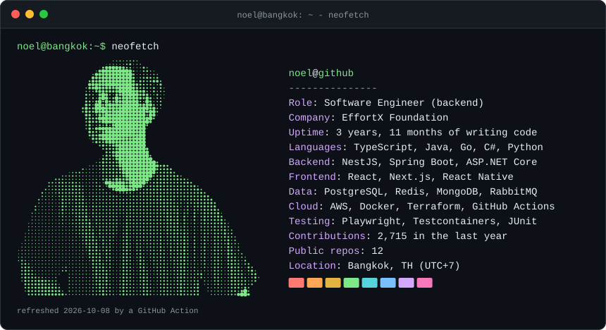

<picture>
  <source media="(prefers-color-scheme: dark)" srcset="./assets/hello-dark.svg" />
  <source media="(prefers-color-scheme: light)" srcset="./assets/hello-light.svg" />
  
</picture>

 

  &nbsp;
  &nbsp;
  

 

## `~/projects`

<table>
<tr>
<td width="50%" valign="top">

### [AU-Van](https://github.com/NoelPOS/au-van-platform)
LINE-integrated van seat booking for Assumption University.

- Concurrent seat holds, booking expiry and waitlist promotion, with PostgreSQL constraints as the source of truth
- Transactional outbox → LINE Flex Message notifications with retries and dead-lettering
- AWS target in Terraform (Fargate across 2 AZs, Multi-AZ RDS, CloudFront), proven in an evidence session; live demo on EC2 with CI/CD gated by 9 checks

`Spring Boot` `React` `PostgreSQL` `Terraform` `AWS`
 [Live demo](https://auvan.duckdns.org) · [Code](https://github.com/NoelPOS/au-van-platform)

</td>
<td width="50%" valign="top">

### [VetMiMi](https://github.com/VetMiMi) · in development
Booking and online sessions for an art therapy practice in Sydney.

- Go API: appointment booking, content management, media and email, with an OpenAPI-first design
- One-to-one WebRTC video sessions with Go signaling, TURN, and MFA/TOTP for the admin
- Bilingual Next.js site (English and Burmese) plus an admin console, with background jobs on Redis

`Go` `Next.js` `PostgreSQL` `Redis` `WebRTC`
 [Live](https://vetmimi-arts-therapy.vercel.app) · [API](https://github.com/VetMiMi/vetmimi-api) · [Web](https://github.com/VetMiMi/vetmimi-next)

</td>
</tr>
</table>

## `~/experience`

| When | Role | What I did |
|---|---|---|
| **Sep 2025 – now** | **Software Developer** · [EffortX Foundation](https://www.effort.foundation) · remote | Next.js, React Native, NestJS and PostgreSQL · Redis/BullMQ background jobs · RBAC, JWT and MFA/TOTP · **cut p95 API latency from 850 ms to 350 ms** |
| **Jul – Sep 2026** | **QA Automation Intern** · KBTG (Kasikorn Business-Technology Group) | Robot Framework and Python suites for SIT, UAT and regression testing of enterprise financial apps |
| **Apr 2025 – Mar 2026** | **Full Stack Developer** · [Kiddee Lab Thailand](https://www.kiddeelab.co.th) | LMS/CRM that replaced paper workflows for **800+ users** · migrated and reconciled **10,000+ legacy records** · built the public site [kiddeelab.co.th](https://www.kiddeelab.co.th) |
| **Jun 2023 – Jun 2025** | **WordPress Developer & Teaching Assistant** · Assumption University | Merged two legacy sites into one platform for 1,000+ students · mentored 20+ students in DSA and OOP |
| **2022 – 2026** | **B.Sc. Computer Science** · Assumption University | GPA **3.88 / 4.00** |

## `~/stack`

<picture>
  <source media="(prefers-color-scheme: dark)" srcset="./assets/neofetch-dark.svg" />
  <source media="(prefers-color-scheme: light)" srcset="./assets/neofetch-light.svg" />
  
</picture>
