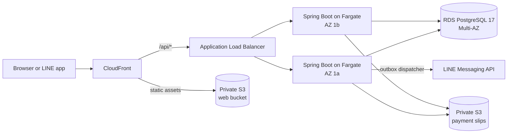

<h1 align="center">Noel Paing Oak Soe</h1>

  <b>Software Engineer · Backend &amp; Distributed Systems</b> 
  Event-driven systems, cloud infrastructure and reliability — owned from design to production.

  
  
  
  

---

I build backends that stay correct under pressure: bookings that can't be oversold, payments that can't be charged twice, and notifications that arrive exactly once. I've spent 2+ years shipping and running production platforms, and I write down the decisions behind them.

**Right now**
- 💼 Software Developer at **EffortX Foundation**
- 🛠️ Building **[VetMiMi](https://vetmimi-next.vercel.app)**: booking and WebRTC video sessions on a Go API
- 🤝 Open to **backend and full-stack engineering roles**

## 💼 Experience

| When | Role | Highlights |
|---|---|---|
| **Sep 2025 – now** | **Software Developer** · [EffortX Foundation](https://www.effort.foundation) · remote | Next.js, React Native, NestJS and PostgreSQL for 1,000+ users · Redis/BullMQ background jobs · RBAC, JWT and MFA/TOTP · **cut p95 API latency from 850 ms to 350 ms** |
| **Jul – Sep 2026** | **QA Automation Intern** · KBTG (Kasikorn Business-Technology Group) | Robot Framework and Python suites for SIT, UAT and regression testing of enterprise financial apps |
| **Apr 2025 – Mar 2026** | **Full Stack Developer** · [Kiddee Lab Thailand](https://www.kiddeelab.co.th) | LMS/CRM that replaced paper workflows for **800+ users** · migrated and reconciled **10,000+ legacy records** |
| **Jun 2023 – Jun 2025** | **WordPress Developer & Teaching Assistant** · Assumption University | Merged two legacy sites into one platform for 1,000+ students · mentored 20+ students in DSA and OOP |
| **2022 – 2026** | **B.Sc. Computer Science** · Assumption University | GPA **3.88 / 4.00** |

## 🚀 Featured work

<table>
<tr>
<td width="50%" valign="top">

### [AU-Van](https://github.com/NoelPOS/au-van-platform)
LINE-integrated van seat booking for Assumption University.

- Concurrent seat holds, booking expiry and waitlist promotion, with PostgreSQL constraints as the source of truth
- Transactional outbox → LINE Flex Message notifications with retries and dead-lettering
- Terraform on AWS (ECS Fargate across 2 AZs, ALB, RDS Multi-AZ, CloudFront), with 9 CI checks including Playwright

`Spring Boot` `React` `PostgreSQL` `Terraform` `AWS`
 [Live demo](https://auvan.duckdns.org) · [Code](https://github.com/NoelPOS/au-van-platform) · [15 ADRs](https://github.com/NoelPOS/au-van-platform/tree/main/docs/adr)

</td>
<td width="50%" valign="top">

### [VetMiMi](https://github.com/VetMiMi) · in development
Booking and online sessions for an art therapy practice in Sydney.

- Go API: appointment booking, content management, media and email, with an OpenAPI-first design
- One-to-one WebRTC video sessions with Go signaling, TURN, and MFA/TOTP for the admin
- Bilingual Next.js site (English and Burmese) plus an admin console, with background jobs on Redis

`Go` `Next.js` `PostgreSQL` `Redis` `WebRTC`
 [Live](https://vetmimi-next.vercel.app) · [API](https://github.com/VetMiMi/vetmimi-api) · [Web](https://github.com/VetMiMi/vetmimi-next) · [9 ADRs](https://github.com/VetMiMi/vetmimi-api/tree/main/docs/adr)

</td>
</tr>
<tr>
<td width="50%" valign="top">

### [TaskFlow](https://github.com/NoelPOS/taskflow-distributed-job-platform)
Distributed async job processing across independent services.

- Accepts work immediately and processes it in a separate worker service
- Event-driven messaging over RabbitMQ with MassTransit
- Pushes job status to the browser in real time with SignalR, so the client never polls

`.NET 10` `RabbitMQ` `MassTransit` `SignalR`
 [Code](https://github.com/NoelPOS/taskflow-distributed-job-platform)

</td>
<td width="50%" valign="top">

### [Fortuner](https://github.com/NoelPOS/Fortuner)
Full-stack services marketplace with wallet payments and live sessions.

- Discovery and booking flows, plus credit-based payments and a payout lifecycle
- Real-time sessions over Socket.IO and Stream Video
- Admin moderation and financial operations tooling

`Next.js 15` `NestJS 11` `PostgreSQL` `Stripe`
 [Code](https://github.com/NoelPOS/Fortuner)

</td>
</tr>
</table>

## 🧠 Hard problems, written down

I record significant design decisions as ADRs (architecture decision records). A few I'd point an engineer to first:

| Problem | How I solved it | Read |
|---|---|---|
| Two students grab the last seat at the same moment | Holds and bookings share one `seat_claims` table, and a unique key on the seat settles every race. Holds expire lazily, so correctness never waits on a scheduler | [AU-Van ADR-006](https://github.com/NoelPOS/au-van-platform/blob/main/docs/adr/006-seat-claims-single-table-and-lazy-hold-expiry.md) |
| A flaky network retries "Confirm booking" | Idempotency keys: a retry with the same key returns the stored response byte for byte, and the same key with a different body is refused | [AU-Van ADR-008](https://github.com/NoelPOS/au-van-platform/blob/main/docs/adr/008-exactly-once-booking-creation.md) |
| A booking saves but its LINE message is lost | Transactional outbox: the notification row commits with the booking, and each retry carries the same LINE retry key, so a phone gets the message at most once | [AU-Van ADR-010](https://github.com/NoelPOS/au-van-platform/blob/main/docs/adr/010-transactional-outbox-and-booking-deadline.md) |
| Users must never see each other's payment slips | Private bucket, and the API brokers every read and write, so no storage URL or credential ever reaches a browser | [AU-Van ADR-009](https://github.com/NoelPOS/au-van-platform/blob/main/docs/adr/009-payment-proof-storage-and-review-gate.md) |
| Two clients book overlapping therapy sessions | A PostgreSQL exclusion constraint on each session's time range, buffers included, rejects any overlap no matter how many requests race. A pending request *is* the hold, and a background job expires it | [VetMiMi ADR-004](https://github.com/VetMiMi/vetmimi-api/blob/main/docs/adr/004-postgresql-owns-scheduling.md) |
| Private video sessions without paying per minute for a video API | Peer-to-peer WebRTC: the Go API only relays offers, answers and ICE candidates over WebSocket, using short-lived room tickets, and a self-hosted coturn relay covers strict networks | [VetMiMi ADR-007](https://github.com/VetMiMi/vetmimi-api/blob/main/docs/adr/007-one-to-one-webrtc-with-go-signaling.md) |

<b>🏗️ AU-Van's AWS target architecture</b> (rendered by GitHub from Mermaid)

 

Written in Terraform and applied for an evidence session; the always-on demo runs on EC2 with Docker Compose and continuous deployment. [Details →](https://github.com/NoelPOS/au-van-platform#architecture)

## 🛠️ Toolbox

   
   
   
  

<b>More projects</b>

 

| Project | What it is | Stack |
|---|---|---|
| [Kiddee Lab LMS](https://github.com/Kiddee-Lab-Company-Limited) | Production LMS/CRM that replaced paper workflows for 800+ users ([web](https://github.com/Kiddee-Lab-Company-Limited/kdl-frontend), [api](https://github.com/Kiddee-Lab-Company-Limited/kdl-backend)) | Next.js · NestJS · PostgreSQL |
| [CodePilot](https://github.com/NoelPOS/codepilot) | AI prompt-to-code workspace with live Sandpack preview and a bring-your-own-key model | Next.js · Convex · Gemini |
| [Disease Predictor](https://github.com/NoelPOS/disease-predictor) | Compares ML classifiers for predicting a disease from symptoms | Python · ML · ONNX |
| [Conserve](https://github.com/NoelPOS/Conserve-App) | Hackathon app that helps people cut their carbon footprint (TriValley Hackathon) | React Native · Express · MongoDB |
| [100 Days of DevOps](https://github.com/NoelPOS/KobeCloud_100_Days_of_Devops) | Lab notes from the KodeKloud 100 Days of DevOps challenge | Linux · Docker · K8s |

